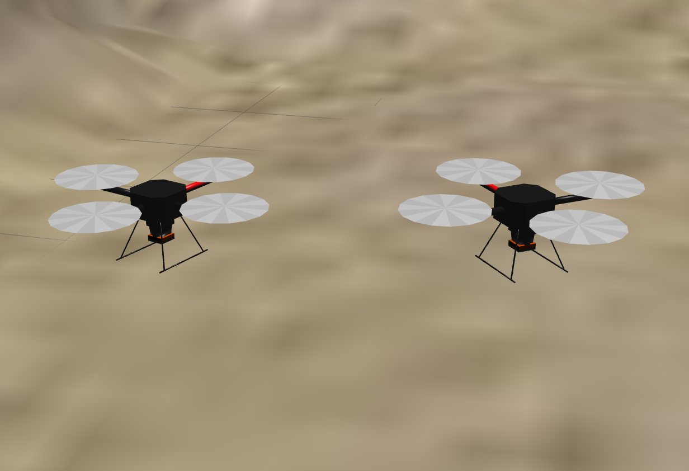
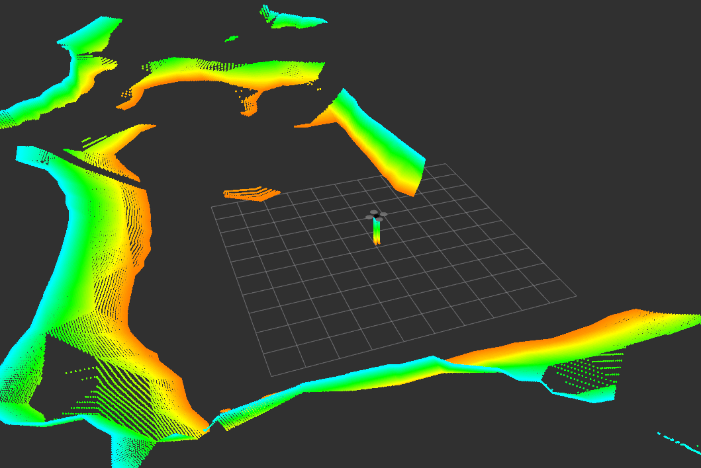
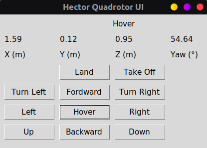

# Drone tracking based on YOLO

The title of this project is drone tracking based on yolo, which uses yolo target detection technology to detect and impact target drones. The drone model and the underlying control program came from an open source project [**hector-quadrotor-noetic**](https://github.com/RAFALAMAO/hector-quadrotor-noetic).


<p align="center">
     
</p>


## Requirements

**Recommended environment:**ROS Noetic & Gazebo 11

I. You need the following packages before install `hector_quadrotor_noetic`.

* unique_identifier:
    ```sh
    git clone https://github.com/ros-geographic-info/unique_identifier.git
    ```
* geographic_info:
    ```sh
    git clone https://github.com/ros-geographic-info/geographic_info.git
    ```

II. Build.

```sh
cd ~/catkin_ws && catkin_make
```

III. Clone `hector_quadrotor_noetic`.

```sh
git clone https://github.com/RAFALAMAO/hector_quadrotor_noetic.git
```

IV. Repeat step II.

## Usage

Run the following commands to perform related operations. Each command needs to be executed in a new terminal window.

* Run the following for two drones inside outdoor world:

  ```sh
  roslaunch hector_quadrotor_demo two_drones_outdoor.launch
  ```

* Use yolov5 detector:(You need to read the README document in the yolov5_ros folder to configure the environment, the model is better accelerated by gpu.)

  ```sh
  roslaunch yolov5_ros yolo_v5.launch
  ```

* Use xbox to control the drones:

  ```sh
  roslaunch hector_quadrotor_teleop xbox_controller.launch
  ```

* Use the UI control interface for manhunt and other operations:

  ```sh
  rosrun hector_ui ui_hector_quad_leader.py
  ```

* Print the yolo topic information:

  ```
  rostopic echo /yolov5/BoundingBoxes
  ```

## Others

Run a simulation by executing the launch file in `hector_quadrotor_gazebo` and `hector_quadrotor_demo` packages (only these work at the momment, but you can try other ones):

* Run the following for one drone inside an empty world:
    ```sh
    roslaunch hector_quadrotor_gazebo quadrotor_empty_world.launch
    ```
* Run the following for one dron outdoor:
    ```sh
    roslaunch hector_quadrotor_demo outdoor_flight_gazebo.launch
    ```
* Run the following for one dron outdoor without rviz interface:
    ```sh
    roslaunch hector_quadrotor_demo outdoor_flight_gazebo_no_rviz.launch
    ```
* Run the following for two drones inside an empty world:
    ```sh
    roslaunch hector_quadrotor_demo two_drones_empty.launch
    ```
  Run the following for two drones inside outdoor world:
    ```sh
    roslaunch hector_quadrotor_demo two_drones_outdoor.launch
    ```
## You can control it with:
* teleop_twist_keyboard.
    ```sh
    git clone https://github.com/ros-teleop/teleop_twist_keyboard
    ```
  **Note:** check use in: https://github.com/ros-teleop/teleop_twist_keyboard
* User interface, shared by my friend [__anderdefector__](https://github.com/anderdefector) and adapted by me. You can find the code in __hector_ui/src__ folder inside this repo.
    <br/>
    
    
    * Run the following for one drone ui:
        ```sh
        rosrun hector_ui ui_hector_quad.py
        ```
    * If you are working with `two_drones_empty.launch`.
        * Run the following for leader drone ui:
            ```sh
            rosrun hector_ui ui_hector_quad_leader.py
            ```
        * Run the following for follower drone ui:
            ```sh
            rosrun hector_ui ui_hector_quad_follower.py
            ```
    * __Note:__ `Land` and `Take Off` buttons don't work with `hector_quadrotor`.


## Show

Here is a [video](https://www.bilibili.com/video/BV1aQ8qeZEtn/?share_source=copy_web&vd_source=ddad7ad1be8989119bed5da443573693) show it:

[](https://www.bilibili.com/video/BV1aQ8qeZEtn/?share_source=copy_web&vd_source=ddad7ad1be8989119bed5da443573693)


